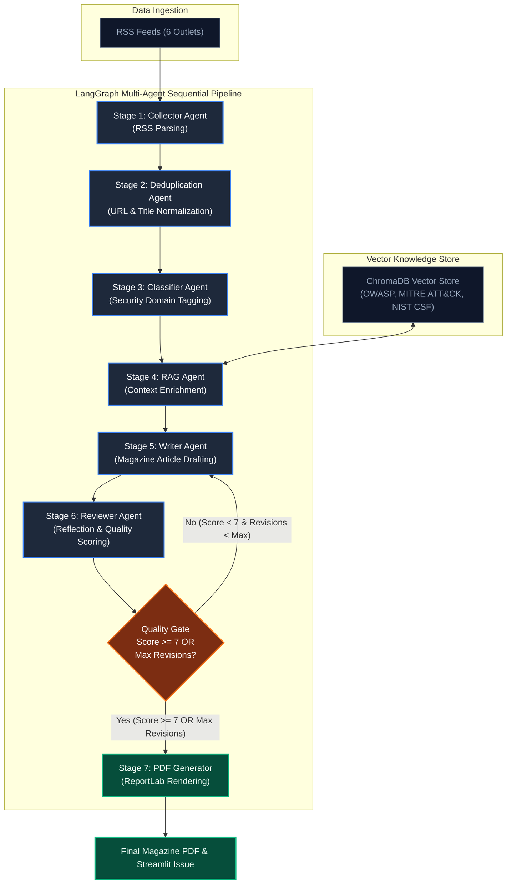

# CyberQuill — Autonomous Multi-Agent Cybersecurity Intelligence & Magazine Platform

**CyberQuill** is an autonomous multi-agent cybersecurity intelligence platform orchestrated with [LangGraph](https://github.com/langchain-ai/langgraph). Specialized AI agents collect news from multiple RSS feeds, deduplicate articles, classify security threats, enrich content using Retrieval-Augmented Generation (RAG) over a vector store, write magazine-style analytical articles, perform reflection quality reviews, and generate downloadable PDF magazines.

**Live Streamlit Demo:** [https://cyberquillagent-93zujbgqd8wwfuzm4why6b.streamlit.app/]
## Architecture

```
Collector → Duplicate → Classifier → RAG → Writer → Reviewer → PDF
```

CyberQuill uses a **sequential pipeline** of 6 AI agents orchestrated by [LangGraph](https://github.com/langchain-ai/langgraph):

| Agent | Role |
|-------|------|
| **Collector** | Fetches cybersecurity news from RSS feeds |
| **Duplicate** | Removes duplicate articles using URL and title matching |
| **Classifier** | Categorizes articles (Malware, Data Breach, Zero-Day, etc.) |
| **RAG** | Enriches articles with context from a cybersecurity knowledge base |
| **Writer** | Generates magazine-style articles with full analysis |
| **Reviewer** | Reviews, critiques, and approves articles for publication |

## Quick Start

### Prerequisites

- Python 3.13+
- [Groq API Key](https://console.groq.com/keys)
- [OpenRouter API Key](https://openrouter.ai/keys)

## Quick Start (Local)

```bash
# 1. Clone the repository
git clone https://github.com/vikumkodikara/CyberQuill_Agent.git
cd CyberQuill_Agent

# 2. Create a virtual environment
python -m venv venv
# Windows: .\venv\Scripts\Activate.ps1
# macOS/Linux: source venv/bin/activate

# 3. Install dependencies
pip install -r requirements.txt

# 4. Set up environment variables
copy .env.example .env
# Edit .env with your GROQ_API_KEY and OPENROUTER_API_KEY

# 5. Run automated test suite
pytest tests/ -v

# 6. Launch the Streamlit application
streamlit run streamlit_app.py
```

---

## Architecture & Pipeline Flow



```
[ RSS Feeds ] ──▶ [ Collector ] ──▶ [ Duplicate ] ──▶ [ Classifier ] ──▶ [ RAG Agent ] ◀──▶ [ ChromaDB KB ]
                                                                             │
                                                                             ▼
[ Final PDF ] ◀── [ PDF Generator ] ◀── [ Quality Gate ] ◀── [ Reviewer ] ◀── [ Writer Agent ]
                                               │                                  │
                                               └──────── ( Revision Loop ) ───────┘
```

### Agent Roles & Responsibilities

| Agent | Module Path | Role |
| :--- | :--- | :--- |
| **Collector** | `agents/collector.py` | Fetches real-time cybersecurity headlines & metadata from 6 RSS feeds using `feedparser`. |
| **Duplicate** | `agents/duplicate.py` | Filters out duplicate or highly similar news items via normalized title & URL matching. |
| **Classifier** | `agents/classifier.py` | Categorizes articles into security domains (Malware, Data Breach, Zero-Day, AI Security, etc.). |
| **RAG** | `agents/rag.py` | Queries ChromaDB knowledge base to inject framework context (MITRE ATT&CK, OWASP, NIST CSF). |
| **Writer** | `agents/writer.py` | Synthesizes raw news and RAG context into structured, magazine-style articles. |
| **Reviewer** | `agents/reviewer.py` | Evaluates quality, accuracy, and depth (0–10 score), returning feedback for revision. |
| **PDF Generator** | `pdf/generator.py` | Renders approved articles into print-ready PDF magazine layouts using ReportLab. |

---

## Agent-to-Agent Communication

Agents exchange strongly-typed Pydantic report contracts through a shared LangGraph state (`CyberQuillState`) rather than unstructured free-form text.

Report contracts are defined in [`models/schemas.py`](file:///e:/Projects/CyberQuill/models/schemas.py):
- **`Article`**: Collector → Duplicate output (URL, title, summary, published date, source)
- **`ClassifiedArticle`**: Classifier output (`Article` + assigned security category & confidence score)
- **`EnrichedArticle`**: RAG output (`ClassifiedArticle` + retrieved framework context & citations)
- **`MagazineArticle`**: Writer output (headline, lead paragraph, deep analysis, key takeaways, mitigations)
- **`ReviewedArticle`**: Reviewer output (`MagazineArticle` + score, critique, revision suggestions, approved status)
- **`MagazineIssue`**: Complete compiled magazine issue with metadata, table of contents, and approved articles

---

## AI Design Patterns

| Pattern | Implementation File | Role in CyberQuill |
| :--- | :--- | :--- |
| **Orchestrator-Worker** | [`orchestrator/pipeline.py`](file:///e:/Projects/CyberQuill/orchestrator/pipeline.py) | Central LangGraph pipeline orchestrates sequential and conditional agent execution. |
| **Reflection / Self-Correction** | [`agents/reviewer.py`](file:///e:/Projects/CyberQuill/agents/reviewer.py) → [`agents/writer.py`](file:///e:/Projects/CyberQuill/agents/writer.py) | Reviewer evaluates drafted articles (score < 7 triggers revision loop back to Writer). |
| **Router / Conditional Edge** | [`orchestrator/pipeline.py`](file:///e:/Projects/CyberQuill/orchestrator/pipeline.py) (`should_revise`) | Routes execution dynamically based on quality thresholds and maximum revision limits. |
| **Tool Use** | [`agents/collector.py`](file:///e:/Projects/CyberQuill/agents/collector.py) & [`agents/rag.py`](file:///e:/Projects/CyberQuill/agents/rag.py) | Collector uses `feedparser` RSS tool; RAG uses `ChromaDB` vector search tool. |
| **Planning & Decomposition** | [`orchestrator/pipeline.py`](file:///e:/Projects/CyberQuill/orchestrator/pipeline.py) | Deconstructs magazine generation into 6 discrete, single-responsibility stages. |

---

## Model Selection Strategy

| Sub-task | Provider | Model | Latency | Cost | Context / Reasoning | Why Selected |
| :--- | :--- | :--- | :--- | :--- | :--- | :--- |
| **Classification, Writing, Reviewing** | **Groq** | `llama-3.3-70b-versatile` | Ultra-low | Near-free / Low | 128k context, strong JSON parsing | Blazing-fast inference speed required for multi-article processing without Streamlit timeouts. |
| **Fallback & Complex Reasoning** | **OpenRouter** | `meta-llama/llama-4-maverick` | Low-medium | Low | High reasoning capability | Reliable secondary fallback for complex threat analysis when primary provider hits limits. |

*Configured in `.env` / Streamlit secrets. Deterministic fallbacks keep the application functional even without active API keys.*

---

## Retrieval-Augmented Generation (RAG) Architecture

APIs supply dynamic real-time headlines, while the local RAG knowledge base provides evergreen cybersecurity frameworks and vulnerability guidance.

| Aspect | Implementation Details |
| :--- | :--- |
| **Knowledge Base Corpus** | `data/documents/` (20 curated Markdown topic documents covering OWASP, MITRE ATT&CK, NIST CSF, Zero-Day Exploits, AI Security, Zero Trust, Ransomware, Cloud Security, DevSecOps, API Security, Container/K8s, IAM, IR, Malware Analysis, DDoS, Cryptography/PKI, Threat Intel, IoT Security, etc.) |
| **Chunking Strategy** | Heading & paragraph splitting (~500–1000 characters per chunk with overlap) |
| **Embeddings** | `sentence-transformers/all-MiniLM-L6-v2` |
| **Vector Store** | `ChromaDB` (Persistent storage at `./chroma_db`) |
| **Build Process** | Auto-indexes `data/documents/` on initialization; caches vector collection locally |
| **Fallback Strategy** | Text keyword matching / direct document retrieval if ChromaDB or embeddings service is uninitialized |
| **Shared Context** | Injected into `EnrichedArticle.rag_context` and passed to Writer agent for grounding |

### RAG Evaluation Examples (5 Benchmark Test Cases)

| # | Query / Topic | Expected Knowledge Base Reference | Observed Relevance |
| :-: | :--- | :--- | :--- |
| **1** | Web Application Vulnerabilities | `owasp_top_10.md` | **High** — Broken Access Control, Injection, Cryptographic Failures |
| **2** | Threat Actor Tactics & Techniques | `mitre_attack.md` | **High** — TTP mapping, Initial Access, Privilege Escalation |
| **3** | Incident Response Framework | `nist_csf.md` | **High** — Identify, Protect, Detect, Respond, Recover core functions |
| **4** | Enterprise Ransomware Prevention | `ransomware.md` | **High** — Offsite backups, immutable logs, zero-trust network segmentation |
| **5** | Cloud Security Misconfigurations | `cloud_security.md` | **High** — IAM policies, S3 bucket exposure, shared responsibility model |

---

## Live Data Sources & Fallbacks

| Concern | Source | Fallback Mechanism |
| :--- | :--- | :--- |
| **News Headlines & RSS** | 6 Live Cybersecurity RSS Feeds | Cached `data/issue_history.json` sample articles |
| **Deduplication** | Title & URL similarity matching | Passes through all items if parsing fails |
| **Threat Context** | ChromaDB RAG Vector Store | Default framework summaries from settings |
| **PDF Generation** | ReportLab engine | Raw text / Markdown output view in Streamlit UI |

---

## Educational Purpose & Legal Disclaimer

> [!IMPORTANT]
> **This project is strictly developed for educational, academic, and research purposes only.**

- **Non-Commercial Use:** CyberQuill is a personal academic and technical project created to showcase multi-agent AI system design, LangGraph orchestration, Retrieval-Augmented Generation (RAG), and automated content summarization. It is not used for commercial monetization, subscription services, or profit generation.
- **Content Ownership & Intellectual Property:** All news articles, headlines, excerpts, and original text ingested by CyberQuill remain the exclusive intellectual property of their original publishers, authors, and media organizations.
- **Fair Use Notice:** Content collected via publicly accessible RSS feeds is processed, classified, and synthesized under Fair Use principles for academic analysis, educational synthesis, and AI research demonstrations.

---

## News Source Credits & Attribution

CyberQuill aggregates real-time security intelligence using public RSS feeds from prominent cybersecurity journalism outlets and official government advisory channels. Full credit, copyright, and publishing rights belong entirely to the original content creators listed below:

| Source | Description | Official Website |
| :--- | :--- | :--- |
| **The Hacker News** | Global cybersecurity news platform covering cyber threats, vulnerabilities, and malware analysis. | [thehackernews.com](https://thehackernews.com) |
| **BleepingComputer** | Security and tech publication specializing in ransomware outbreaks, vulnerabilities, and tech news. | [bleepingcomputer.com](https://www.bleepingcomputer.com) |
| **Krebs on Security** | Investigative cybersecurity journalism focused on cybercrime, data breaches, and security threats by Brian Krebs. | [krebsonsecurity.com](https://krebsonsecurity.com) |
| **SecurityWeek** | Enterprise cybersecurity news platform delivering insights on threat intelligence, risk, and compliance. | [securityweek.com](https://www.securityweek.com) |
| **Dark Reading** | Cyber risk management and operational security network for IT and security professionals. | [darkreading.com](https://www.darkreading.com) |
| **CISA** | Official alerts, vulnerability bulletins, and infrastructure security advisories from the Cybersecurity & Infrastructure Security Agency. | [cisa.gov](https://www.cisa.gov) |

*We express our sincere appreciation and credit to these publishers and investigative journalists for providing open RSS feeds that empower cybersecurity awareness and educational research.*

---

## Project Structure

```
CyberQuill/
├── agents/                  # AI Agent Implementations
│   ├── collector.py         # Stage 1: RSS Feed Collector Agent
│   ├── duplicate.py         # Stage 2: Deduplication Agent
│   ├── classifier.py        # Stage 3: Security Category Classifier Agent
│   ├── rag.py               # Stage 4: RAG Context Enrichment Agent
│   ├── writer.py            # Stage 5: Article Writer Agent
│   └── reviewer.py          # Stage 6: Reflection & Quality Reviewer Agent
├── config/                  # Configuration & Prompts
│   ├── settings.py          # Pydantic environment configuration & RSS sources
│   └── prompts.py           # System prompts & template definitions
├── data/                    # Knowledge Base & Saved Output
│   ├── documents/           # Markdown RAG documents (OWASP, MITRE, NIST, etc.)
│   ├── output/              # Generated PDF magazines & JSON reports
│   └── issue_history.json   # Historical issue store
├── models/                  # Data Models & Contracts
│   └── schemas.py           # Pydantic report contracts (Article, MagazineIssue, etc.)
├── orchestrator/            # LangGraph Graph Construction
│   └── pipeline.py          # StateGraph topology & reflection revision loops
├── pages/                   # Streamlit Multi-Page UI
│   ├── 1_Latest_News.py     # Live RSS feed explorer
│   ├── 2_Categories.py      # Category filter & classifier preview
│   ├── 3_RAG_Testing.py     # RAG knowledge base search & similarity tool
│   ├── 4_Generate_Magazine.py # Full multi-agent pipeline generator UI
│   ├── 5_Agent_Logs.py      # Real-time pipeline step execution logs
│   └── 6_About.py           # Architecture overview & documentation
├── pdf/                     # PDF Rendering Engine
│   └── generator.py         # ReportLab custom layout & PDF compiler
├── tests/                   # Pytest Automated Test Suite
│   ├── test_collector.py
│   ├── test_duplicate.py
│   ├── test_classifier.py
│   ├── test_rag.py
│   ├── test_writer.py
│   ├── test_reviewer.py
│   ├── test_pipeline.py
│   └── test_pdf.py
├── utils/                   # Logging & Helpers
│   └── logger.py            # Centralized project logger
├── streamlit_app.py         # Main Streamlit application entry point
├── requirements.txt         # Dependencies
└── .env.example             # Environment template
```

---

## Deployment Checklist (Streamlit Community Cloud)

1. Push your repository to GitHub (`github.com/vikumkodikara/CyberQuill_Agent`).
2. Go to [share.streamlit.io](https://share.streamlit.io/) → **New App**.
3. Select Repository, Branch (`main`), and set Main file path to `streamlit_app.py`.
4. Add environment secrets under **App Settings → Secrets**:
   ```toml
   GROQ_API_KEY = "your_groq_api_key"
   OPENROUTER_API_KEY = "your_openrouter_api_key"
   ```
5. Click **Deploy** and monitor build logs during model weight caching.

---

## Automated Testing

Run the full pytest suite to verify all agents, schemas, and pipeline execution locally:

```bash
pytest tests/ -v
```

---

## License & Fair Use

This project is open-sourced strictly for academic, educational, and research evaluation under non-commercial terms.

---

## Author

**Vikum Kodikara**  
[GitHub Profile](https://github.com/vikumkodikara)

---

## Known Limitations

- **Pipeline Latency**: Running the full 6-agent pipeline with writing and reflection loops may take 1–3 minutes depending on LLM response speeds.
- **RSS Feed Availability**: Intermittent downtime or structure changes in source RSS feeds can affect real-time article collection.
- **API Rate Limits**: Rapid consecutive generations on free tier API keys (Groq/OpenRouter) may trigger rate limit warnings.
- **RAG Context Window**: Large framework files are chunked to fit LLM context windows, which may truncate secondary details.
